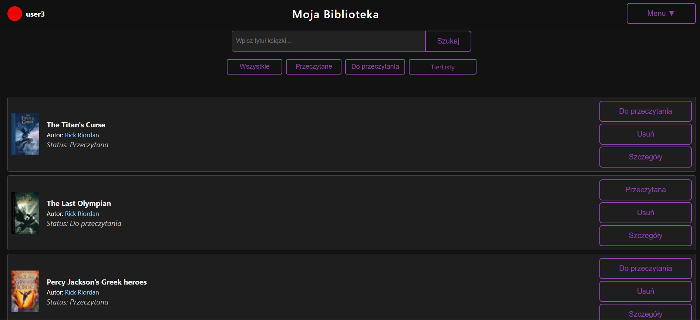
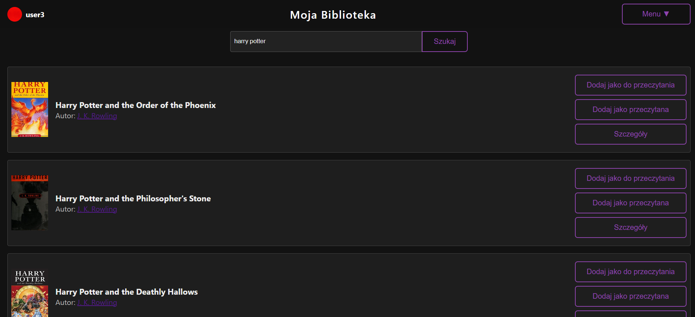
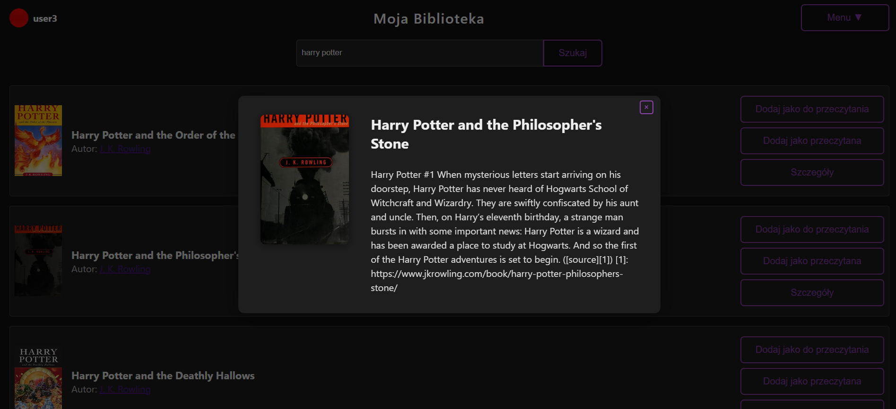
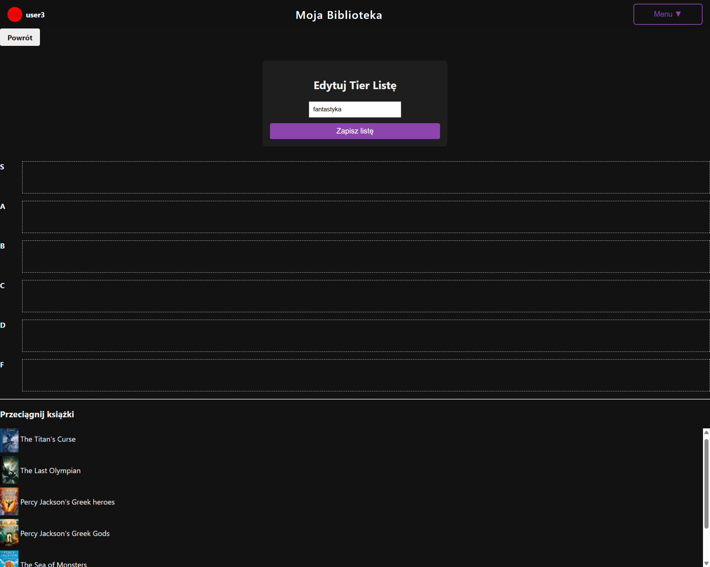
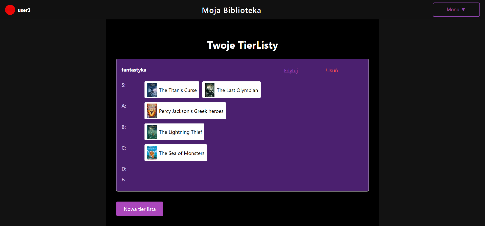

# 📚 BookTrackerPL

Aplikacja do śledzenia przeczytanych książek oparta na api Open library – frontend w React, backend w Node.js + MongoDB.

---

## ✨ Funkcjonalności

- Zapisywanie przeczytanych książek oraz książek do przeczytania
- Wyświetlanie szczegółów książki
- Wyświetlanie innych dzieł autora
- Tworzenie tierlist przeczytanych książek


---

## 🚀 Szybki start z Dockerem

Upewnij się, że masz zainstalowane **Docker** 🐳, **Docker Compose** i w razie potrzeby włączony Docker Desktop a następnie uruchom:

```bash
docker-compose up --build
```

✅ To polecenie:

- buduje obrazy Dockera  
- uruchamia MongoDB, backend i frontend  

🌐 Aplikacja będzie dostępna pod adresami:
- Frontend: [http://localhost:3000](http://localhost:3000)  
- API (backend): [http://localhost:5001](http://localhost:5001)

---

## 🛠️ Ręczna instalacja

### 📋 Wymagania

- Node.js 18+ 🟢  
- Działająca instancja MongoDB 🗃️ (lokalnie lub przez Docker)

---

### 🔧 Backend

```bash
cd server
copy envExample .env
npm install
npm start
```

📄 Plik `.env` powinien zawierać:

- `PORT` – port serwera (np. 5001)  
- `MONGODB_URI` – adres MongoDB  
- `JWT_SECRET` – sekret JWT do autoryzacji 🔐

---

### 💻 Frontend

```bash
cd client
npm install
npm start
```

Aplikacja frontendowa uruchomi się domyślnie na [http://localhost:3000](http://localhost:3000) 🌍

---

📌 **Wskazówka**: Możesz używać aplikacji z Dockerem lub ręcznie – wybierz, co wolisz!

Zrzuty ekranu:









